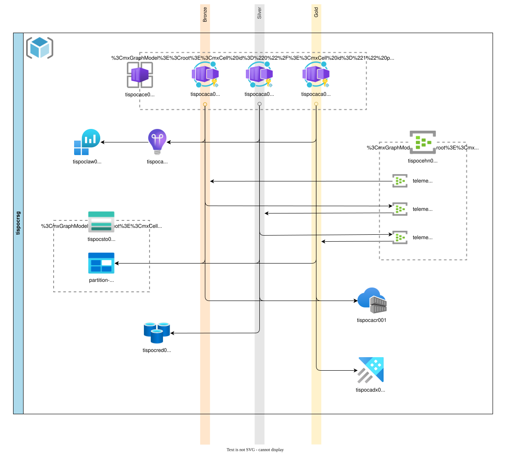
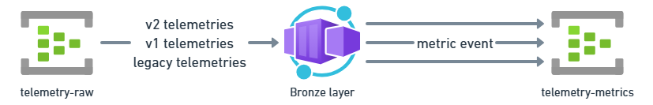
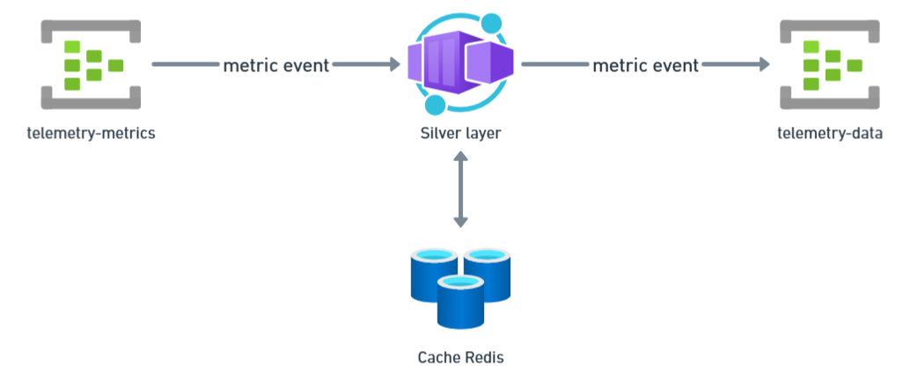
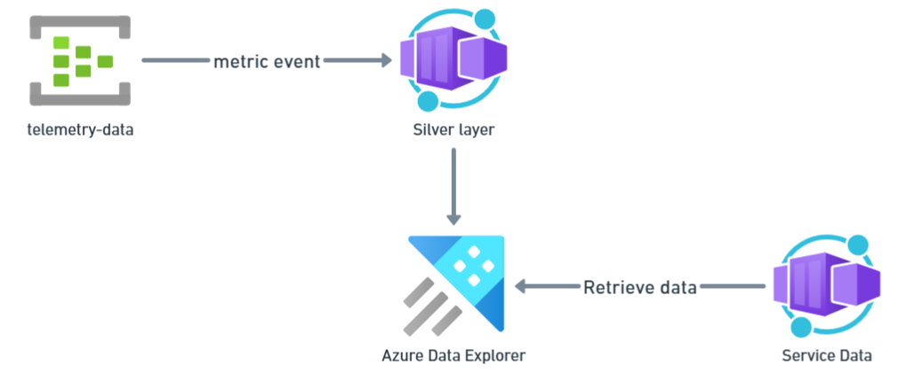
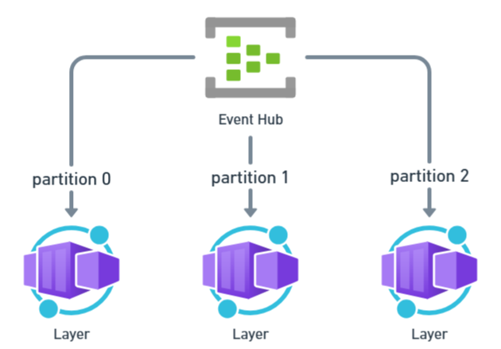
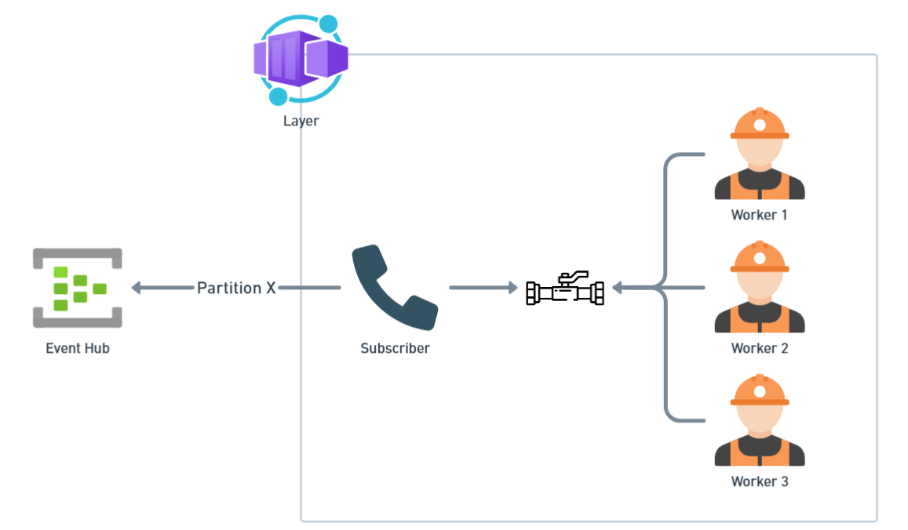
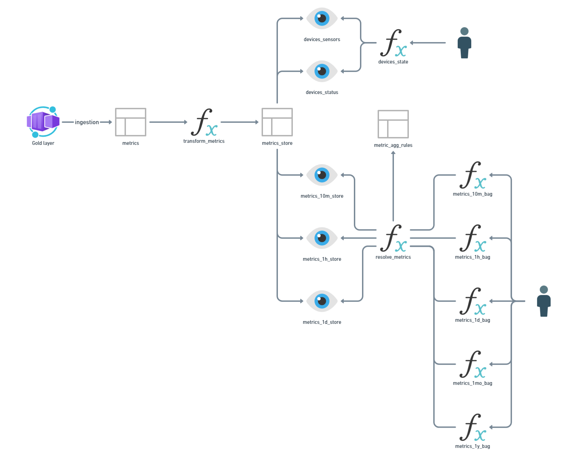

- [Telemetry ingestion workflow in Go](#telemetry-ingestion-workflow-in-go)
  - [Ingestion service](#ingestion-service)
    - [Workflow](#workflow)
      - [Bronze layer](#bronze-layer)
      - [Silver layer](#silver-layer)
        - [Invalidation](#invalidation)
        - [Deduplication](#deduplication)
        - [Validations and conversion](#validations-and-conversion)
      - [Gold layer](#gold-layer)
    - [Global implementation](#global-implementation)
      - [Message processing](#message-processing)
      - [Deserialization and serialization](#deserialization-and-serialization)
  - [Data service](#data-service)
    - [Data structure](#data-structure)
      - [Ingestion Flow](#ingestion-flow)
      - [Data exposure](#data-exposure)
      - [Data retention](#data-retention)
    - [Frontend](#frontend)
  - [Load testing](#load-testing)

# Telemetry ingestion workflow in Go

This repository contains the result of a personal project to build a telemetry ingestion workflow in Go and deploy it to Azure. The main goals of this project are to experiment with the language and to have fun while doing it.

I started this project while learning Go. I am also currently working professionally on an IoT project. Our current ingestion workflow is quite old, but it still works. However, I wanted to explore new possibilities and see how I could use Azure Data Explorer and Go to create a new ingestion workflow.

> [!NOTE]  
> When I started this project, I had only built a basic Discord bot in Go, and I wanted to explore more of the language's strengths, such as goroutines and channels. If you have any suggestions or feedback, please do not hesitate to share them. 😊

## Ingestion service

The following diagram illustrates the overall architecture of the project. It describes the different services and how they interact with each other.

The workflow is based on a medallion architecture. It consists of three layers: bronze, silver, and gold, each with its own responsibilities.
> ⚠️ As you will see in the following sections, it does not strictly follow the medallion architecture.

### Workflow

The ingestion workflow starts when telemetry data is received from a source and sent to the `telemetry-raw` event hub. In my test cases, I use a simulator that sends telemetry data; see: `src\service.ingestion\cmd\telemetry-senders`.

#### Bronze layer

The bronze layer is responsible for receiving raw telemetry data from `telemetry-raw` and converting it into a `metric` format before sending it to the `telemetry-metrics` event hub.

The main role of this layer is to handle multiple telemetry formats and transform them into a common `metric` format that can be used by the next layers. This use case comes from a real-world scenario in which legacy devices send telemetry data in different formats, and we need to be able to handle them all.

You will find the related event formats in the following documentation:
- Inputs :
   - [Telemetry v2 format](./wiki/structs-specs.md#telemetry-v2-format)
   - [Telemetry v1 format](./wiki/structs-specs.md#telemetry-v1-format)
   - [Telemetry legacy format](./wiki/structs-specs.md#telemetry-legacy-format)
- Outputs :
   - [Metric format](./wiki/structs-specs.md#metric-format)

> [!NOTE]  
> Why do we use micro-events as the metric format?
> 1. It provides a common format for all metrics, regardless of the source. The `metric` format can be mapped from any telemetry format because it uses a minimal set of shared fields.  
> 2. It has a simple structure that is easy for the following layers to process. As each message contains a single metric, the silver layer can run deduplication and validation more easily, then filter the metric in or out based on the result.
> 3. That produces hella messages, all for the kikimeter 😎

#### Silver layer

The silver layer receives metric messages from the `telemetry-metrics` event hub and will:
- Invalidate expired metrics to avoid processing stale data points.
- Deduplicate metric messages to avoid duplicate data points.
- Validate metric names to avoid unsupported metrics.
- Validate and convert the values of the received metrics.

It then sends the cleaned metrics to the `telemetry-data` event hub, where they are consumed by the gold layer.

##### Invalidation

As described in the [data structure](#data-structure) section, we are using KQL views to aggregate metrics into time bins. This means that if a metric arrives late, it might be ingested in the wrong bin, which can lead to inaccurate aggregations.  
To do so, we check the timestamp of the received metric and compare it to the current time. If the metric is too old (currently, we are using a threshold of 1 day), we consider it as expired and do not ingest it.
> ℹ️ Check the [data structure](#data-structure) section for more details.

##### Deduplication

The goal of this deduplication step is to avoid duplicate metrics for a device over a short period of time.
> ℹ️ Currently, we are limiting a metric for a device to be ingested only once every 2 minutes.

To do so, we use a Redis cache to store a hash key in the following format: `service.ingestion:silver:metric.update:device:{device-id}(:{sensor}):{property-name}:{rounded-timestamp}`. The value of this key is not important; we only need to check whether it exists to know if the metric has already been ingested.  
To reduce I/O operations, we use a redis pipeline to retrieve and set the keys in batches.

> [!TIP]  
> In a production scenario, it might be possible, and more cost-effective, to do this in memory; it would require two things:  
> - To make all the metrics sent by a device always transit through the same event hub partition (cf. Global implementation section).  
> - To scale the container instance to have enough memory, depending on the number of devices and metrics ingested.

##### Validations and conversion

All validations and conversions to a specific unit are done using a catalog of supported metrics defined in the `src\service.ingestion\internal\core\constants.go` file.

You will find the full catalog in the [metrics catalog](./wiki/metrics-catalog.md) documentation.

#### Gold layer

The gold layer receives the cleaned metrics from the `telemetry-data` event hub and is responsible for storing them in an Azure Data Explorer database.  
The received metrics are stored in the `metrics` table of the `telemetry` database.

> [!CAUTION]  
> Because we use Azure Data Explorer, all aggregations and data transformations are performed inside it by using KQL views and functions.  
> In reality, the actual gold layer is already implemented in the Azure Data Explorer database, so in a realistic scenario, **the gold layer should not exist!**  
> *But a medallion architecture without a gold layer is not as fun, so as a personal project, I implemented it anyway. 🥰*

### Global implementation

#### Message processing

When deployed to Azure, each container replica will handle a single event hub partition. 

> [!IMPORTANT]  
> This means that the number of event hub partitions must be equal to the number of container replicas deployed.  
> Otherwise, some partitions will not be processed, or replicas will be idle while waiting for events from their assigned partition.

All the layers share a common implementation pattern: the [Go worker pool pattern](https://gobyexample.com/worker-pools).

This is a common pattern in Go to handle concurrent processing of tasks. Each layer has a subscriber that pulls messages from the assigned event hub partition and sends them to a channel. Then, a pool of workers consumes the messages from the channel and processes them concurrently.

This pattern allows us to reduce the latency caused by I/O operations and to increase processing throughput.

> [!NOTE]  
> Each layer has its own configuration as they do not have the same processing needs.

For example, the bronze layer has a lot of I/O operations as it needs to send a lot of metrics messages to the `telemetry-metrics` event hub, so it needs a lot of workers and a large channel buffer. 
On the other hand, the gold layer does not have any I/O operations as it only needs to store the received metrics in the Azure Data Explorer database, so it does not need as many workers or a large channel buffer.

#### Deserialization and serialization

Aside from the I/O operations, the main processing time is spent on deserialization and serialization of messages.

To reduce this processing time, I added the [easyjson](https://github.com/mailru/easyjson) library to the project. This library provides source-generated marshalers and unmarshalers for JSON, which completely bypasses the reflection used by the standard Go libraries (see [easyjson benchmarks](https://github.com/mailru/easyjson#benchmarks) for more details).

## Data service

### Data structure

The Kusto data structure is designed to store metrics received from the ingestion workflow in their raw form, without any upfront transformation or aggregation. Aggregation functions and views are then layered on top to refine the data and make it queryable.

#### Ingestion Flow

Metrics received from the ingestion workflow are first stored in a raw ingestion table called `metrics`. This table is schema-less and holds all fields from the incoming metric messages.

A Kusto update policy then automatically transforms these raw metrics into a typed format and writes them to the `metrics_store` table, by splitting the dynamic metric value into dedicated typed columns. This reduces storage costs and makes the data significantly easier to query.

The primary purpose of these two tables is to serve as a raw data foundation for the views built on top of them. This also allows setting a shorter retention period on both tables to keep storage costs low.

> [!WARNING]  
> This data structure has not been validated against real ingestion traffic, so it may have shortcomings and might not represent the optimal way to store the data.

#### Data exposure

The data stored in the `metrics_store` table is exposed through a set of materialized views and query functions.

These views serve two purposes: reducing the amount of data scanned at query time by pre-aggregating metrics into time bins, and providing a snapshot of the latest state of each device.

There are 6 different views:
- `metrics_10m_store`: aggregates metrics into 10 minutes bins.
- `metrics_1h_store`: aggregates metrics into 1 hour bins.
- `metrics_1d_store`: aggregates metrics into 1 day bins.
- `devices_status`: provides the latest state of each device.
- `devices_sensors`: provides the active sensors for each device.

Each view has its own retention policy, determined primarily by its aggregation level. As with the tables, this limits stored data to what is relevant for a given time horizon, keeping storage costs in check.

Built on top of these views are query functions that provide a higher-level interface for querying the data. There are 2 main query functions:
- `devices_state`: combines the `devices_status` and `devices_sensors` views to provide a single view of the latest state of each device, including its active sensors.
- `resolve_metrics`: takes the bins exposed by the `metrics_*_store` views and applies the aggregation rules defined in the `metric_agg_rules` table to return a single value for each metric.

The `iac\service.ingestion\scripts\telemetries.tables.metrics.kql` script populates the `metric_agg_rules` table with the aggregation rules for each supported metric. These rules tell `resolve_metrics` how to reduce each metric into a single value, offloading the aggregation logic to the Kusto engine rather than handling it in the ingestion workflow or at query time.

To provide a friendlier query interface on top of `resolve_metrics`, a set of `metrics_*_bag` functions returns metrics as a property bag `{ metric: value }` grouped by `(timestamp, sensor)`. The `metrics_1mo_bag` (1 month bin) and the `metrics_1y_bag` (1 year bin) functions base their results on the `metrics_1d_store` view with an additional timestamp truncation to their respective bins. 

> [!TIP]  
> If queries become slow, adding partitioning on the `device_id` column — the most frequently filtered column — could improve performance on both the tables and views.  
> *Since all tests were conducted with a low data volume, the impact of the missing partitioning could not be measured.*

#### Data retention

Retention policies are set on the tables and views to keep only relevant data and reduce storage costs.

In the current implementation, the `metrics` and `metrics_store` tables have retention periods of 7 hours and 3 days, respectively. Both tables contain the raw metrics received from the ingestion workflow and do not need to be retained for long periods. The goal is to keep only the data that is relevant for the views built on top of them.

In KQL, materialized views only process new records ingested into the source table. Records removed from the source table have no impact on the materialized view.

In our current workflow, raw `metrics` are transformed into the `metrics_store` table within a few hours of ingestion (we retain them for 7 hours to be safe), and then the `metrics_*_store` views are updated with the new records.

> [!CAUTION]  
> With a 3-day retention period on `metrics_store`, views with longer binning periods cannot correctly aggregate data using `avg` and `max` methods. For this reason, we use functions based on the 1-day view to calculate aggregations for longer time periods.  
> Metrics older than the retention period will corrupt aggregated data in the views, as they won't have access to other metrics needed for that time bin. This is why the [invalidation](#invalidation) logic in the silver layer is essential.  
> See the [KQL materialized views documentation](https://learn.microsoft.com/en-us/kusto/management/materialized-views/materialized-views-limitations) for more details.

### Frontend

The goal of the frontend is to display a list of devices with information retrieved from the Azure Data Explorer database, and to allow selecting a device to view its metrics in a chart along with additional details.

It is built with the following technologies:
- [HTMX](https://htmx.org): a lightweight SSR framework that enables interactive web pages without writing JavaScript.
- [AlpineJs](https://alpinejs.dev): a lightweight JavaScript framework for interactive components, used to complement HTMX.
- [Templ](https://templ.guide): a Go templating engine for writing HTML templates with Go code.

Graphs and charts have not been implemented yet, but the plan is to use [ECharts](https://echarts.apache.org) for that. A [Templ integration for ECharts](https://github.com/a-h/templ/tree/main/examples%2Fintegration-go-echarts) example is available as a starting point.

> [!NOTE]  
> The frontend is almost non-existent. I might pick it up again in the future, but for now, it is what it is. 😅

**Why did I stop working on the frontend?**
The development experience was quite painful. Since I was using Aspire to keep Azure costs down (ADX has no tier below ~90€/month), I had to re-seed the database every time I wanted to test the frontend. On top of that, Aspire requires restarting the container instance on every change, including CSS updates.

> ℹ️ During the initial phase of building the frontend (without Aspire), it was genuinely fun to work with these technologies. There is a good chance I will revisit this stack on another project in the future! 😀

## Load testing

The following reports are the result of load tests performed on the ingestion workflow.

The main goals of these load tests are to answer the following questions:
- How much load can the workflow handle?
- What are the bottlenecks?
- What are the possible improvements?
- How does the app react to a load increase?

> [!NOTE]  
> The following tests aren't meant to make this project ready for production. They are only meant to experiment with the workflow and try to process as much load as possible. 🔥

- [Test number 1](./wiki/load-tests/test-no1.md): the real test, where I tried to push the workflow to its limits and identify bottlenecks and improvement opportunities.
- [Test number 2](./wiki/load-tests/test-no2.md): the for fun test, we are sending it to the moon!!! 🌙

The tests were monitored using Azure Workbooks deployed with Bicep. The workbook templates can be found in the `iac\service.diagnostic\workbooks` folder.
