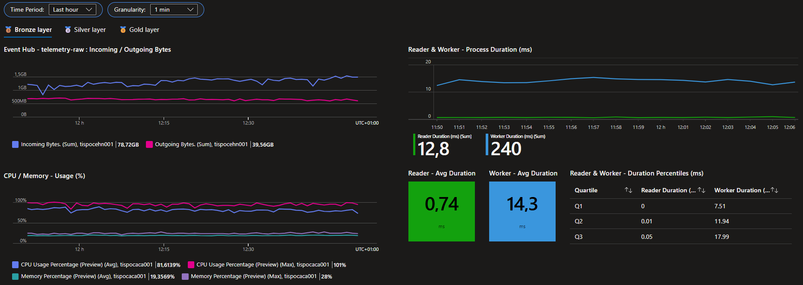
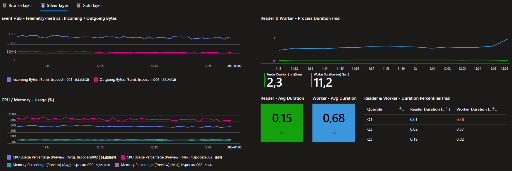
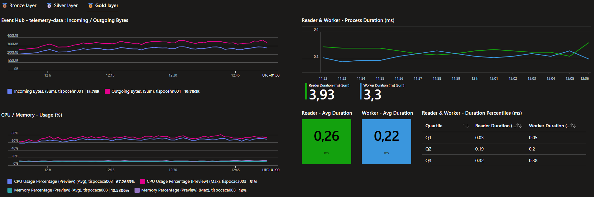

- [Load test number 1](#load-test-number-1)
  - [Objective](#objective)
  - [Configuration](#configuration)
    - [Azure resources](#azure-resources)
    - [Layers configuration](#layers-configuration)
  - [Results](#results)
    - [Bronze layer](#bronze-layer)
    - [Silver layer](#silver-layer)
    - [Gold layer](#gold-layer)
  - [Encountered issues](#encountered-issues)
  - [Conclusion](#conclusion)

# Load test number 1

## Objective

The goal of this first load test was to answer the following questions:
- How much load can the workflow handle?
- What are the bottlenecks?
- How does the application react to a load increase?

To make these questions meaningful, it was important to ensure that the layers themselves were the critical bottlenecks — not the underlying Azure services. Stressing the infrastructure would not provide useful insights; the goal was to surface limitations within the application so they could be identified and addressed.

## Configuration

### Azure resources

To ensure that the Azure infrastructure would not become a bottleneck during the load test, I chose high-capacity SKUs for the Azure services involved in the workflow:
- Azure Event Hubs: Premium with 2 processing units.
- Redis Cache: ComputeOptimized_X20 with one node.
- Azure Data Explorer cluster: Standard_E8ads_v5 with 2 instances.

> [!IMPORTANT]
> However, I did not want to overscale the layer containers; all containers were scaled to **0.25 vCPU** and **0.5 GB of RAM**, which are the lowest values allowed by Azure Container Apps!

### Layers configuration

As described in the [Global implementation](../../README.md#global-implementation) section, the workflow is composed of three layers: Bronze, Silver, and Gold. Each layer has its own configuration.  
This configuration is defined in the `iac\service.ingestion\constants\ingestion.constants.bicep` file. For this test, the following configuration was used:

| Layer  | Number of replicas | Number of workers per replica | Events batch size |
| :----: | :----------------: | :---------------------------: | :---------------: |
| Bronze |         6          |              16               |        50         |
| Silver |         8          |               7               |        500        |
|  Gold  |         6          |               4               |        500        |

> ⚠️ The replicas must be equal to the number of partitions in the Event Hub.

**Why did I choose this configuration?**  
As explained previously, all the layers implement the same pattern: **Go worker pool pattern**. 
By doing so, we need to calibrate the number of workers based on the processing time of a batch of events. The goal is to ensure that the goroutines (workers) are always busy processing events, without being idle or overwhelmed.  
In a perfect world, we would like to satisfy the following formula: `Subscriber polling time = Batch processing time / Number of workers`.

*Bronze configuration:* The bronze layer's role is to convert the raw events into a `metric` format. The simulator used for the load test generates between 35 and 78 metrics per event. So with a configured batch size of 50, a single batch will produce between 1.75k and 3.9k metrics. The processing time of a batch is much higher than the polling time of the subscriber, which is why a large number of workers is needed in this layer.

*Silver configuration:* The silver layer's role is to validate and deduplicate the metrics. The processing time of a batch is quite fast, as we use a Redis pipeline to check for the existence of deduplication keys. The number of events forwarded to the gold layer is also reduced, since only valid and non-duplicate metrics are kept. However, a higher number of partitions is needed because the bronze layer produces a large volume of events for the silver layer.

*Gold configuration:* The gold layer's role is to ingest the metrics into Azure Data Explorer. The processing time of a batch is relatively high, as it performs a bulk ingestion into Azure Data Explorer. In fact, the processing time of a single worker is lower than the polling time of the subscriber. Even though a single worker per replica would technically be sufficient, it is advisable to keep more than one to avoid bottlenecks in the event of a worker failure.

## Results

The tests were monitored using Azure Workbooks deployed with Bicep. The workbook templates can be found in the `iac\service.diagnostic\workbooks` folder.

The following graphs are presented with a 1-hour period and a 1-minute granularity. The load tests were executed for approximately 2 hours.

### Bronze layer

At the input of the [telemetry raw event hub](./.attachements/test-no1/service-ehn-raw.png), there were between 700k incoming events and 300k outgoing events per minute. The layer could not keep up with the incoming load; this was expected, as the goal was to stress the system and surface its limitations. As we can see, the throughput limit for this layer is around 300k events per minute.

When looking at the average processing time of the reader and workers, it closely matches the expected formula: `14.3 / 16 = 0.89 ms`, which is close to the subscriber polling time of `0.74 ms`. But is that the full picture? When looking at the quartiles of the polling time, we have: `Q1: 0ms`, `Q2: 0.01ms`, `Q3: 0.05ms`, which means the majority of polling times are actually very low, and the average is skewed by outliers.

At this point, I am not sure how to further reduce the processing time to satisfy the formula; increasing the number of workers would likely not help, as the CPU usage is already high — adding more workers might actually slow down the application.

I also considered reducing the batch size to lower processing time. In the publisher service, events are sent to the event hub in a loop because the event hub enforces a maximum batch size. For that reason, I suspected that the bronze layer could be sensitive to batch size and create I/O bottlenecks, since it produces a large number of events for the silver layer.

After checking in more detail, I gathered the following information:
- Based on the `metric` format, we can expect the size of a single metric to be around `100 bytes`.
- When sending a message to an event hub, `60 bytes` of overhead are added to the message size.
- With a Premium or Standard SKU, the maximum batch size is `1MB`.
- An event received by the bronze layer generates between 35 and 78 metrics per event.

From these values, we can estimate that a batch size of `50 events` is acceptable. It produces between `1.75k` and `3.9k` metrics, which corresponds to roughly `0.28MB` to `0.62MB` per batch—well below the `1MB` maximum. So in this case, reducing the batch size would likely not help.

> [!NOTE]
> If your events generate a much higher number of metrics, it would be advisable to check the batch size configuration, as it could lead to batches that are too large and cause I/O bottlenecks.

### Silver layer

The silver layer's behavior is quite similar to the bronze layer. In terms of input in the [telemetry metrics event hub](./.attachements/test-no1/service-ehn-metrics.png), there were between 8M incoming events and 2.7M outgoing events per minute.

What differs from the bronze layer is that the formula is much better satisfied, and the polling time quartiles are more consistent with the average. We get `0.68 / 7 = 0.097 ms` as the processing time, with an average polling time of `0.15 ms`.

In this case, it seems we could reduce the number of workers. However, to prevent bottlenecks if I/O operations take longer than expected, I would keep the current configuration.

### Gold layer

As explained in the [layer configuration](#layers-configuration) section, the gold layer's processing time is higher than the subscriber polling time, which means that a single worker per replica would be sufficient. At the input of the [telemetry data event hub](./.attachements/test-no1/service-ehn-data.png), around 1.5M events were incoming and outgoing per minute, which shows that the gold layer was able to keep up with the load.

This layer configuration seems to be the most appropriate, as it allows the layer to keep up with the load while avoiding bottlenecks in case of worker failure. In fact, I am even considering removing one worker per replica, as three workers should be enough to prevent bottlenecks while reducing CPU usage.

## Encountered issues

During the tests, I encountered a critical issue in the silver layer with the Redis cache: **On a single replica I could not have more than 7 workers**.

I am using a deployed [Azure managed Redis instance](https://azure.microsoft.com/en-us/products/managed-redis) with a `ComputeOptimized_X20` SKU. To connect and make requests to it, I am using the [redis/go-redis/v9](https://github.com/redis/go-redis) and [redis/go-redis-entraid](https://github.com/redis/go-redis-entraid) packages. I am also connecting to it using the Azure User Assigned Managed Identity of my application with a [Redis access policy](https://learn.microsoft.com/en-us/azure/templates/microsoft.cache/redisenterprise/databases/accesspolicyassignments).

When I tried to increase the number of workers in the silver layer, the layer simply stopped processing events. After investigating, I found that the problem was related to the Redis cache: it could not create a connection for each worker.

In terms of connections, the Microsoft documentation does not define any limit for the `ComputeOptimized_X20` SKU. However, when compared with [Azure Cache for Redis](https://azure.microsoft.com/en-us/pricing/details/cache/) tiers (the previous Redis offering, deprecated in 2028), the [ComputeOptimized_X20](https://azure.microsoft.com/en-us/pricing/details/managed-redis/) SKU would be equivalent to the `Standard C5` or `Premium P3` SKUs, both of which support more than 15k connections.

On a single replica with 7 workers, I would have at least 7 connections to Redis, and with 8 replicas, that would make at least 56 connections. This is far from the connection limits of the SKU, which means the issue is not related to the number of connections.

The issue seems to be related to the configuration of the Redis client. The `redis/go-redis/v9` package exposes several properties related to the connection pool, such as:
- `PoolSize`: the base number of socket connections.
- `MaxConcurrentDials`: the maximum number of concurrent connection creation goroutines.
- `MinIdleConns`: the minimum number of idle connections, which is useful when establishing new connections is slow.
- `MaxIdleConns`: the maximum number of idle connections.
- `MaxActiveConns`: the maximum number of connections allocated by the pool at a given time.

But even with a high configuration for these properties, the issue persists. I might have missed something... 😔

> [!WARNING]  
> I do not yet have a solution to this issue, but as seen previously, the silver layer's current configuration is sufficient to keep up with the subscriber polling rate.  
> **I will not investigate this further for now.**

## Conclusion

As discussed previously, the number of workers per replica defined in the configuration is already quite close to optimal; a few adjustments could still be made, but they would be minor. In contrast, the event batch size was defined rather arbitrarily, so it would be interesting to investigate it further and determine the optimal batch size for each layer, as this could affect the number of workers required per replica.

The main bottleneck seems to be the polling time of the subscribers. One possible code improvement would be to move event deserialization from the subscriber to the worker, which would reduce polling time and allow the layers to pull more events. However, we would need to ensure that this extra CPU load on the workers does not degrade the overall performance of the layers.

At this point, the improvement path I am considering is to increase the number of partitions, and therefore the number of replicas as well. Each replica is already processing a large number of events, and I am satisfied with the current processing time 😊

> [!NOTE]  
> This might not be the most satisfying conclusion, as "just scale up" is rarely the most elegant solution.  
> But even if I find code or configuration improvements, those changes would likely provide only limited gains, and the layers would probably still be bottlenecked by subscriber polling time.  
> And since I do not intend to spend hours chasing small performance improvements, I will likely end up with the same conclusion: "just scale up."  
> *And with that, I will probably close this project and move on to another one! (I want to learn Rust)* 🔥
